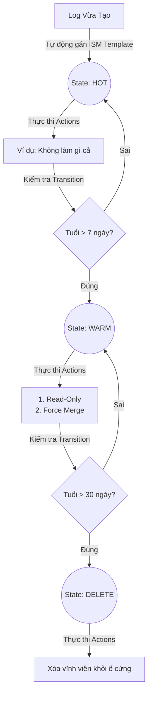

# Tài Liệu Chuyên Sâu: OpenSearch Index State Management (ISM)

Index State Management (ISM) không chỉ là một công cụ dọn rác, mà là một **hệ thống tự động hóa workflow (quy trình làm việc)** dành riêng cho dữ liệu (indices) bên trong OpenSearch. Ở các hệ thống SIEM/SOC lớn (ví dụ thu thập hàng tỷ dòng log từ Wazuh mỗi ngày), ISM chính là xương sống giúp hệ thống chạy ổn định hàng năm trời mà không cần kỹ sư phải thức đêm can thiệp thủ công.

Tài liệu này sẽ mổ xẻ mọi ngóc ngách của ISM từ bề nổi đến bề chìm, giúp bạn hoàn toàn làm chủ hệ thống của mình.

---

## 1. Bản Chất Của ISM (Máy Trạng Thái - State Machine)

ISM được lập trình theo dạng **Máy Trạng Thái (Finite State Machine)**. Một file log (index) tại một thời điểm CHỈ có thể nằm ở MỘT trạng thái (State) duy nhất. 



**Vòng lặp mỗi 5 phút:**
Mặc định, cứ mỗi 5 phút (có thể cấu hình trong cụm), con trùm ISM Daemon của OpenSearch sẽ thức dậy một lần, đi gõ cửa từng file log và hỏi: *"Ê, mày đang ở State nào? Đã làm xong Action chưa? Có đủ điều kiện (Transition) để chuyển sang State mới chưa?"*. 

---

## 2. Giải Phẫu Chuyên Sâu Một ISM Policy (JSON)

Mặc dù bạn dùng giao diện web (Dashboards) để kéo thả, nhưng thực chất bên dưới OpenSearch lưu trữ Policy này bằng một cục JSON. Hiểu cấu trúc JSON này sẽ giúp bạn hiểu tận gốc rễ vấn đề:

```json
{
  "policy": {
    "description": "Lifecycle cho logs-linux-* va logs-windows-*",
    "default_state": "hot", 
    "states": [
      {
        "name": "hot",
        "actions": [],
        "transitions": [
          {
            "state_name": "warm",
            "conditions": { "min_index_age": "7d" }
          }
        ]
      },
      ...
    ],
    "ism_template": [
      {
        "index_patterns": ["logs-linux-*", "logs-windows-*"],
        "priority": 100
      }
    ]
  }
}
```

### 2.1 ISM Templates (Cơ chế Nhận Diện Tự Động)
- **`index_patterns`**: Hỗ trợ ký tự đại diện `*`. OpenSearch hoạt động như một máy quét. Khi Vector tạo ra index `logs-linux-auth-2026.06.27`, hệ thống phát hiện chuỗi này khớp với pattern `logs-linux-*`. Ngay lập tức, policy này được "đính" (attach) vào file đó.
- **`priority`**: Cực kỳ quan trọng ở hệ thống lớn. Giả sử bạn tải một ứng dụng bên thứ 3 về, ứng dụng đó tự tạo một Policy chung chung cho `logs-*` với Priority 0. Policy của bạn ghi rõ `logs-linux-*` có Priority 100. Vì 100 > 0, hệ thống sẽ ưu tiên dùng Policy của bạn. Điều này giúp bạn kiểm soát tuyệt đối việc không bị xung đột (conflict).

---

## 3. Các Cơ Chế Cấp Cứu: Timeout & Retry Backoff

Ép nén ổ cứng (Force Merge) hay Thu nhỏ khoang (Shrink) tốn rất nhiều CPU/RAM. Đôi khi server đang bận phân tích báo cáo (Search), việc chạy Action này sẽ bị văng (Timeout). ISM cung cấp cơ chế "tự cứu" đỉnh cao:

> **Lưu ý:** Lỗi ở đây không phải lỗi do sai cấu hình, mà là "Server tao bận quá, chờ chút!".

- **`retry_count` (Số mạng):** Giống như chơi game, cho phép làm lại tối đa X lần.
- **`delay` (Thời gian hồi chiêu):** Khoảng thời gian cơ sở (ví dụ `1m`).
- **`backoff` (Chiến thuật lùi bước):**
  - **Constant:** Thẳng thừng. Cứ đúng 1 phút đâm đầu vào làm lại 1 lần. Rất dễ làm server chết chìm nếu thực sự nó đang quá tải kéo dài.
  - **Linear (Tuyển tính):** Nhẹ nhàng hơn. Lần 1 chờ 1 phút, lần 2 chờ 2 phút, lần 3 chờ 3 phút.
  - **Exponential (Cấp số nhân - Chuyên nghiệp nhất):** Đây là thuật toán mà hệ thống mạng viễn thông hay dùng. Lần 1 chờ 1 phút, lần 2 chờ 2 phút, lần 3 chờ 4 phút, lần 4 chờ 8 phút... Nó lùi lại rất nhanh để cho server có "không gian và thời gian" xử lý hết rác cũ rồi mới quay lại làm tiếp.

---

## 4. Bảng Tra Cứu "Actions" Dành Cho Chuyên Gia SOC

Đây là toàn bộ "Vũ khí" bạn có thể nhét vào trong mục Actions của mỗi State.

| Phân Loại | Action Name | Giải Thích Kỹ Thuật (Dành cho System Admin) | Tình huống dùng cho SOC/Wazuh |
| :--- | :--- | :--- | :--- |
| **Bảo Mật** | **Read Only** | Chuyển trạng thái index block sang `index.blocks.write: true`. Bất cứ lệnh `POST/PUT` nào vào index này sẽ bị văng lỗi. | Phải làm ngay lập tức sau 7 ngày. Đây là chuẩn Compliance (Tuân thủ) để chứng minh log không bị sửa đổi bởi Hacker. |
| **Hiệu Suất** | **Force Merge** | Gọi API `_forcemerge?max_num_segments=1`. Quét qua tất cả file `.cfs` (Lucene segments) trên ổ cứng, giải nén, trộn lại, lọc bỏ các file đã bị đánh dấu xóa (tombstone) và nén cứng lại làm 1. | Rất tốn CPU lúc chạy, nhưng chạy xong thì việc Search trên Kibana nhanh gấp 10 lần. Dùng ở State `warm`. |
| **Luân Chuyển** | **Add / Remove Aliases** | Trỏ bí danh (alias) vật lý vào index. Nó hoạt động như Symlink (Soft link) trên Linux. | Dùng để tạo Alias cố định `wazuh-alerts-active`. Các tool xuất báo cáo bên thứ 3 chỉ cần query vào alias này thay vì phải tự tính toán hôm nay là ngày mấy. |
| **Phân Tầng Ổ Cứng** | **Allocation** | Thêm rules vào `index.routing.allocation.require`. Bắt buộc file log bị "bứng" khỏi ổ SSD và "ném" sang ổ HDD. | Chỉ dùng khi bạn có cụm máy chủ bự (Hot-Warm-Cold Architecture) trên AWS hoặc Data Center lớn. Không dùng nếu chỉ có 1 con Server cục bộ. |
| **Chống Tràn RAM** | **Close** | Gỡ hoàn toàn file log khỏi RAM (Heap memory của JVM). File vật lý vẫn nằm trên ổ cứng nhưng OpenSearch sẽ mù với file này. | Khi bạn muốn lưu trữ log pháp lý trong 1 năm nhưng server chỉ có 16GB RAM. Ai cần thanh tra thì dùng lệnh **Open** mở lên lại. |
| **Dọn Rác** | **Delete** | Gửi lệnh xóa vật lý `.del` xuống ổ cứng. | Xóa log cũ 30 ngày để chống sập ổ cứng. |
| **Cứu Hộ Dữ Liệu** | **Snapshot** | Đóng băng index lại, tạo bản sao chép (copy) nhị phân, nén thành snapshot và đẩy qua S3 bucket. | Thường nằm ở State cuối cùng, trước khi gọi Action `Delete`. Giữ lại log của năm ngoái trên cloud cực rẻ. |
| **An Toàn Dữ Liệu** | **Replica Count** | Chỉnh `index.number_of_replicas`. | Mới tạo log (rất quý): Replica = 2. Cũ dần: Replica = 1. Gần xóa: Replica = 0 để dọn đường. (Chỉ áp dụng nếu có từ 2 node/server trở lên). |
| **Cắt File Tự Động** | **Rollover** | Rất nâng cao. Yêu cầu phải kết hợp với Alias. Chuyển con trỏ ghi dữ liệu sang index mới tên là `000002` nếu file `000001` đạt 50GB. | Nếu công ty bạn có hàng triệu user, file log 1 ngày có thể phình tới 100GB. Bắt buộc dùng Rollover để tự cắt ra thành 4 file 25GB mỗi ngày. |
| **Nén Báo Cáo** | **Rollup** | Xóa data chi tiết. Chỉ giữ lại con số tổng (Aggregations). | Dành cho việc lưu vĩnh viễn báo cáo kiểu: "Tổng số đăng nhập sai của năm 2026 là 5 triệu lần", chứ không lưu rõ sai lúc mấy giờ, do IP nào. |

---

## 5. Luồng Tư Duy "Best Practice" Cho Kiến Trúc Sư

Khi bạn xây dựng một Policy mới, đừng cắm đầu vào bấm UI. Hãy lấy giấy bút ra và trả lời 3 câu hỏi:
1. **Dữ liệu này là gì?** -> Nếu là log cảnh báo đỏ của Wazuh (`rule.level >= 12`) -> Lưu lâu 90 ngày. Nếu chỉ là log authentication (`logs-linux-auth`) -> Lưu 30 ngày là đủ.
2. **Khách hàng/Giám đốc có cần lục lọi dữ liệu này nhiều không?** -> Nếu có, phải cắm **Force Merge = 1** ngay lập tức vào ngày thứ 7 để họ F5 Dashboards không bị treo.
3. **Tiền (Ổ cứng/RAM) có nhiều không?** -> Nếu ít tiền, áp dụng **Close** sau 14 ngày. Ai cần coi thì kêu IT mở ra. 

Chính sách của bạn (`hot` 7 ngày, `warm` 30 ngày, sau đó `delete`) là một chính sách chuẩn mực, hiệu quả và thanh lịch nhất cho một hệ thống SOC / SIEM cỡ trung bình!
