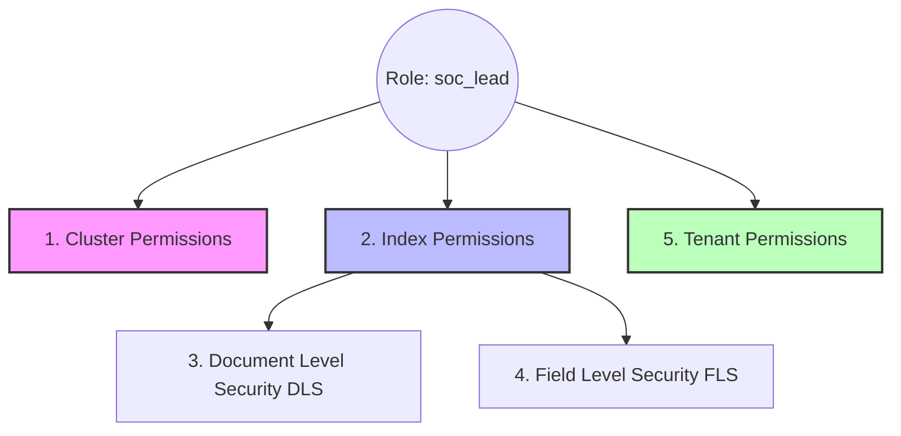

# Tài Liệu Chuyên Sâu: Phân Quyền Bảo Mật (RBAC) Trong OpenSearch

Hệ thống bảo mật của OpenSearch (Security Plugin) hoạt động dựa trên cơ chế **Role-Based Access Control (RBAC - Kiểm soát truy cập dựa trên vai trò)**. Cốt lõi của RBAC là việc tách biệt người dùng (User) ra khỏi quyền hạn (Permissions). Thay vì cấp quyền trực tiếp cho từng người, bạn sẽ tạo ra các Vai trò (Roles) chứa sẵn nhóm quyền, sau đó gán (Map) người dùng vào các Roles này.

Tài liệu này sẽ giải phẫu chi tiết cấu trúc của một Role trong OpenSearch.

---

## 1. Kiến Trúc Của Một Role

Một Role trong OpenSearch được cấu thành từ 5 lớp bảo mật xếp chồng lên nhau:

---

## 2. Giải Phẫu Chi Tiết Các Lớp Phân Quyền

### 2.1. Cluster Permissions (Quyền Hệ Thống / Máy Chủ)
Đây là các quyền ở cấp độ Global (toàn cục). Nó không tác động lên dữ liệu log của bạn, mà tác động lên "bộ máy" quản lý dữ liệu đó.

- **Mục đích:** Cho phép User theo dõi sức khỏe server, quản lý tài khoản khác, hoặc thay đổi luồng xử lý dữ liệu.
- **Ví dụ các Action Groups phổ biến:**
  - `cluster_monitor`: Quyền được xem RAM, CPU, trạng thái ổ cứng của cụm máy chủ.
  - `cluster_composite_ops`: Quyền thực thi các tác vụ tổng hợp như scroll API, bulk API. Thường cấp dưới dạng `_ro` (Read-Only) để không cho phép sửa đổi rủi ro.
  - `cluster_manage_pipelines`: Cấp quyền tạo/sửa đổi/xóa các Ingest Pipeline (Bộ lọc dữ liệu đầu vào).
  - `cluster_all`: Quyền của Admin tối cao, có thể làm mọi thứ.

### 2.2. Index Permissions (Quyền Cấp File / Cơ Sở Dữ Liệu)
Lớp này trả lời 2 câu hỏi: **"Được chạm vào file nào?"** và **"Được làm gì với file đó?"**.

- **Index Patterns (Định vị file):** Sử dụng ký tự đại diện `*` để gom nhóm. Ví dụ: `logs-linux-*` nghĩa là Role này có quyền đối với bất kỳ file nào bắt đầu bằng chữ "logs-linux-". Mọi file khác (như `logs-windows-*` hoặc `system-logs-*`) sẽ trở nên **tàng hình** đối với User mang Role này.
- **Permissions (Hành động):**
  - `read` / `search`: Đọc và tìm kiếm. (Quyền bắt buộc phải có để xem được Dashboards).
  - `write` / `index`: Quyền ghi thêm dữ liệu mới vào file.
  - `delete`: Quyền xóa file (Rất nguy hiểm, tuyệt đối không cấp cho User phân tích).
  - `indices_monitor`: Cấp quyền xem dung lượng, số lượng document của file log đó.

### 2.3. Document Level Security (DLS - Bảo Mật Cấp Dòng)
Đây là tính năng bảo mật dạng "Lưới lọc tàng hình".
- **Cách hoạt động:** Dù bạn đã cấp quyền `read` cho file `logs-windows-*` ở trên, nhưng DLS cho phép bạn nhúng một đoạn mã truy vấn (Query) JSON vào Role. Bất cứ dòng log nào không thỏa mãn Query này sẽ bị giấu đi trước khi hiển thị cho User.
- **Tình huống thực tế:** 
  - Phòng ban SOC có 2 team: Mạng và Máy chủ. Bạn muốn Team Mạng chỉ nhìn thấy log liên quan đến Router/Switch. 
  - Khai báo DLS: `{"bool": {"must": {"match": {"event.category": "network"}}}}`
  - Kết quả: Khi User của Team Mạng tìm kiếm, họ sẽ ảo tưởng rằng hệ thống chỉ có log mạng, mọi log hệ thống khác đã bị giấu đi một cách hoàn hảo.

### 2.4. Field Level Security (FLS - Bảo Mật Cấp Cột) & Anonymization
- **FLS (Field Level Security):** Thay vì giấu cả dòng log (như DLS), FLS chỉ giấu đi một vài cột dữ liệu nhạy cảm. 
  - Ví dụ: Cấp quyền cho nhân viên xem log giao dịch ngân hàng nhưng chặn không cho hiển thị cột `credit_card.cvv` và `user.password`.
- **Anonymization (Ẩn danh):** Xáo trộn dữ liệu của cột đó bằng các ký tự ngẫu nhiên hoặc dấu `*`. Giúp người phân tích vẫn thấy được định dạng dữ liệu (ví dụ biết đó là số điện thoại), nhưng không đọc được nội dung gốc.

### 2.5. Tenant Permissions (Không Gian Làm Việc Chuyên Biệt)
**Tenant** là một trong những tính năng xuất sắc nhất của OpenSearch Dashboards. Nó giống như việc bạn phân chia một tòa nhà lớn thành nhiều văn phòng làm việc độc lập.

- **Mục đích:** Khi đăng nhập vào OpenSearch Dashboards, mỗi User sẽ ở trong một Tenant nhất định. Bất cứ Biểu đồ (Visualizations), Dashboards, hay Báo cáo nào được tạo ra trong Tenant này thì chỉ những người có quyền truy cập Tenant này mới thấy được.
- **Phân quyền Tenant:**
  - `Read and Write`: Cho phép User tự do vẽ thêm, xóa bớt biểu đồ, lưu Dashboard mới trong không gian đó. (Ví dụ cấp cho `soc_lead`).
  - `Read Only`: Cho phép User vào phòng xem biểu đồ, nhưng nút "Save" bị vô hiệu hóa, họ không thể chỉnh sửa hay làm xáo trộn giao diện của phòng. (Ví dụ cấp cho nhân viên trực ca `soc_analyst`).
  - `Global Tenant`: Một Tenant công cộng, ai cũng có thể vào xem. Thường dùng để đặt các Dashboard công cộng cho toàn công ty.

---

## 3. Quy Trình Cấp Quyền (User -> Role Mapping)

Sau khi tạo xong Role (ví dụ `soc_lead`), Role đó chưa có tác dụng gì cả. Bước cuối cùng là bạn phải **Map (Gắn kết)** Role đó cho những đối tượng cụ thể:

1. Vào tab **Mapped Users**.
2. Thêm **Users**: Cấp Role này trực tiếp cho tài khoản `nguyen.van.a`.
3. Thêm **Backend Roles**: Cấp Role này cho một nhóm (Group) được kéo từ hệ thống bên ngoài như Active Directory (Windows Server) hoặc LDAP. Ví dụ: map role `soc_lead` cho nhóm `CN=SOC_Managers,OU=IT`. 

Khi nhân viên thuyên chuyển công tác, bạn chỉ cần gỡ họ khỏi nhóm trên Active Directory, họ sẽ tự động mất quyền `soc_lead` trong OpenSearch mà không cần phải vào đây cấu hình lại!
